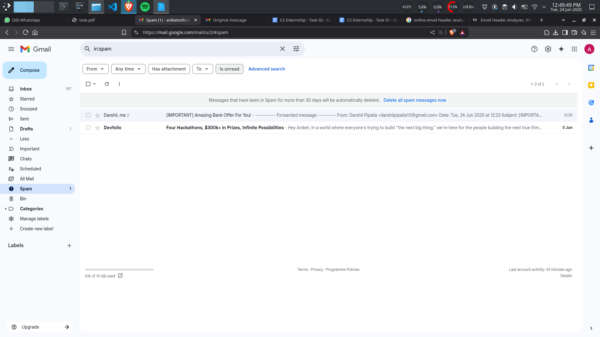
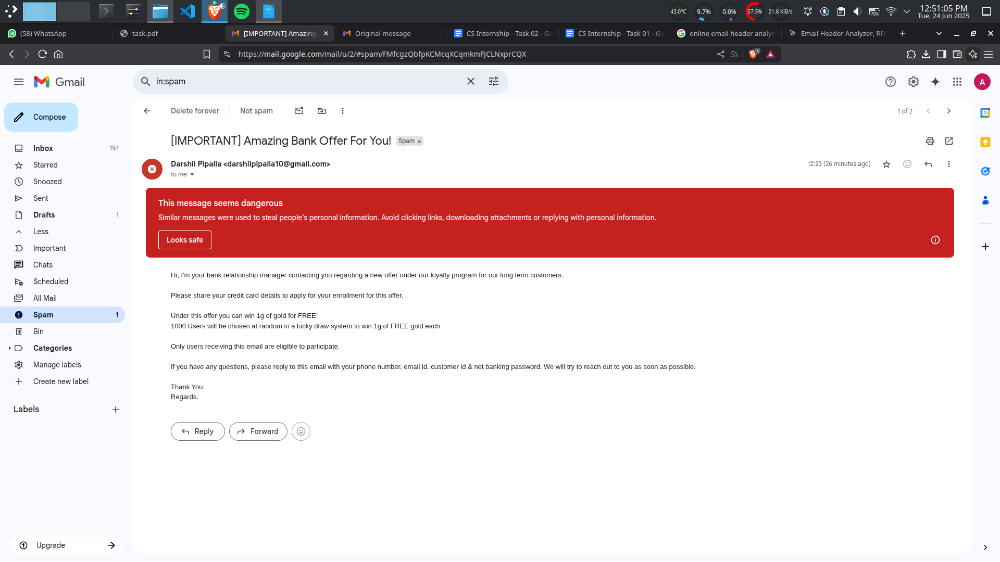
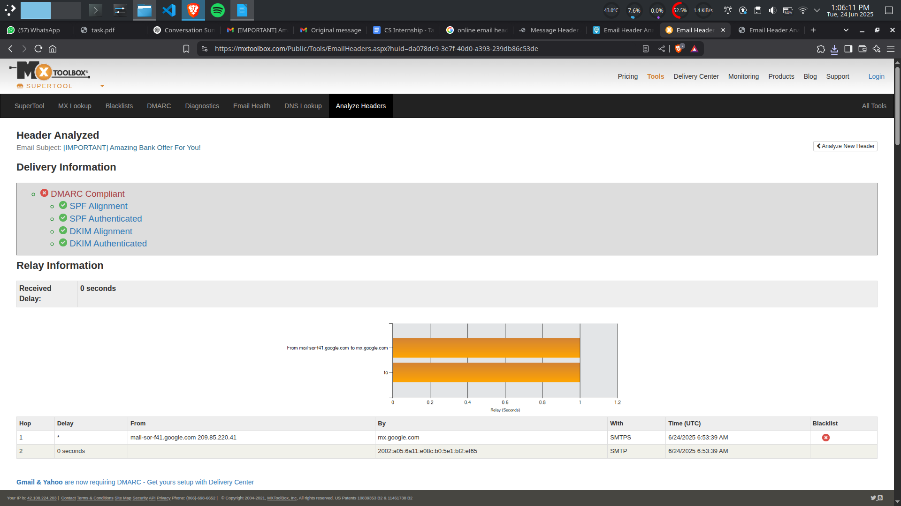

ELEVATE LABS - CYBER SECURITY INTERNSHIP

 
TASK 2: Analyze a Phishing Email Sample.  

 

**Objective:** Identify phishing characteristics in a suspicious email sample.
**Tools:** Email client or saved email file (text), free online header analyzer.
**Deliverables:** A report listing phishing indicators found.

 
Step 1: Obtain phishing mail

We can do this either by getting samples online or using the mails in the “spam” folder.

 
Step 2: Analyze Sender’s Email Address

Darshil Pipalia <darshilpipalia10@gmail.com>

The email address is personal and the body of email suggests that the sender is a Bank’s regional manager. 
A manager should be using its formal email address which contains the bank's name.
Hence, the sender's email address is suspicious.

 
Step 3: Check Email Headers
Open the email -> Click on 3 dots -> Click on “Show Original” -> Copy the email header -> Paste it in an online email header analyzer.

The header has passed all the checks.

 
Step 4: Identify Suspicious Links or Attachments

There is no links or attachments in the email

 
Step 5: Look for Urgent or Threatening Language.

The subject contains “IMPORTANT” in full case which legit emails do not use.

 
Step 6: Examine the message body

“If you have any questions, please reply to this email with your phone number, email id, customer id & net banking password. We will try to reach out to you as soon as possible.”

The email is asking for sensitive information of the user's bank account which marks it suspicious.

 
Step 7: Spot Grammar and Spelling Errors

Some phishing emails contain grammar and spelling errors which is an indicator of phishing mail. But advanced phishing mails have reduced these errors.
The mail we have doesn’t have any errors. But this doesn’t mean its not a phishing mail.

 
THe phishing report is uploaded.

